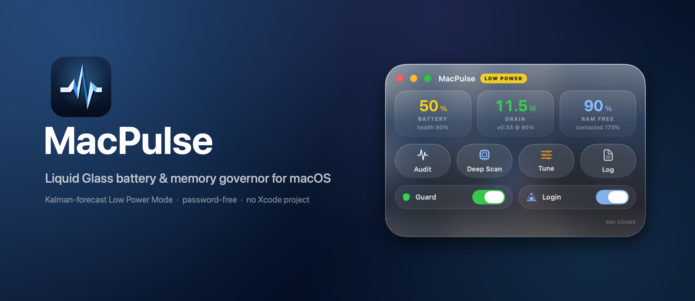
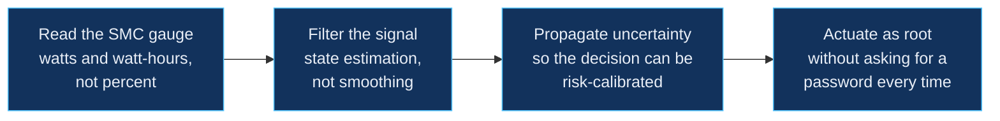
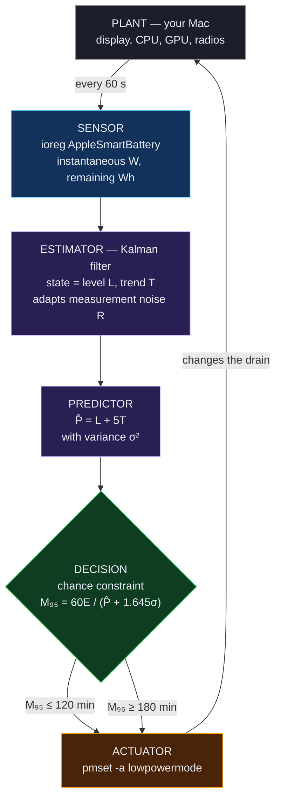
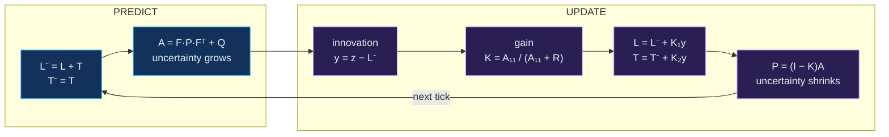
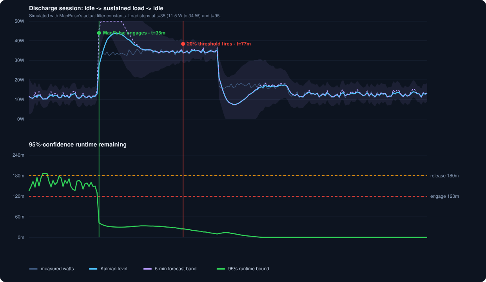
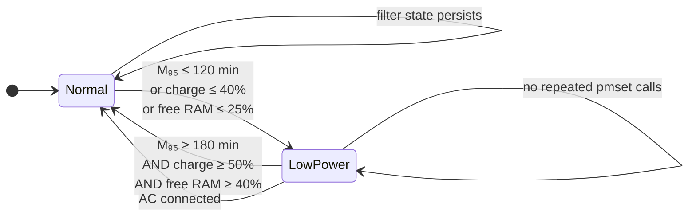
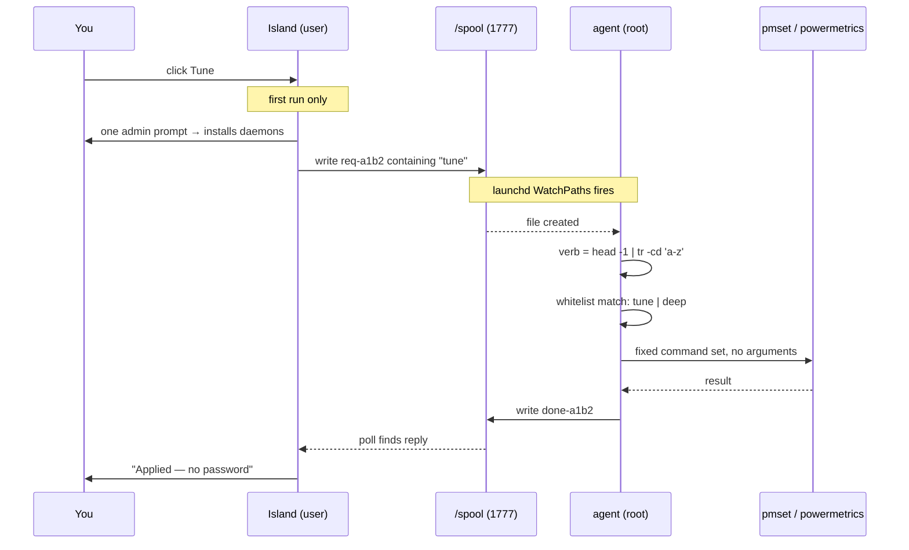
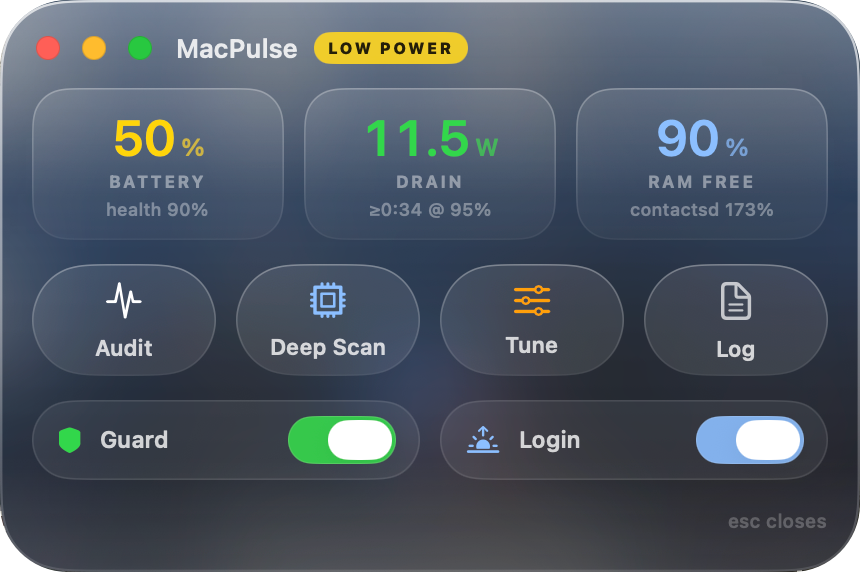

<p align="center">
  
</p>

<p align="center">
  
  
  
  
  
</p>

<p align="center">
  <b>Your Mac decides when to save power using a number that cannot possibly know the answer: battery percentage.</b><br>
  MacPulse replaces it with a filtered forecast of the watts you are actually drawing,<br>
  and acts on <i>predicted minutes of runtime</i> — with the uncertainty carried through the decision.
</p>

---

## Contents

1. [The problem: percentage is the wrong state variable](#1-the-problem-percentage-is-the-wrong-state-variable)
2. [Why you can't already download this](#2-why-you-cant-already-download-this)
3. [The control system](#3-the-control-system)
4. [The estimator, in full](#4-the-estimator-in-full)
5. [The decision rule is a chance constraint](#5-the-decision-rule-is-a-chance-constraint)
6. [Does it actually help? A simulation](#6-does-it-actually-help-a-simulation)
7. [Hysteresis: why it never flaps](#7-hysteresis-why-it-never-flaps)
8. [Memory is forecast the same way](#8-memory-is-forecast-the-same-way)
9. [Password-free root, without a hole](#9-password-free-root-without-a-hole)
10. [The interface](#10-the-interface)
11. [Install, build, uninstall](#11-install-build-uninstall)
12. [Reproduce every claim here](#12-reproduce-every-claim-here)
13. [Limitations and honest caveats](#13-limitations-and-honest-caveats)

---

## 1. The problem: percentage is the wrong state variable

Every battery utility, and macOS itself, makes power decisions from **state of charge** — a percentage. But the question a user actually cares about is *"will this machine last until I'm done?"*, and percentage cannot answer it, because the answer depends on a variable percentage does not contain: **how fast you are currently draining**.

Remaining runtime is energy over power:

```math
M = \frac{E_{\text{Wh}}}{P_{\text{W}}} \times 60 \ \text{minutes}
```

At 50% charge on a 83.6 Wh pack you hold roughly 42 Wh. That is:

| Your workload | Draw | Actual runtime left at 50% |
|---|---:|---:|
| Reading, display dim | 8 W | **5 h 15 m** |
| Normal browsing | 12 W | 3 h 30 m |
| Video call | 22 W | 1 h 54 m |
| Xcode build, discrete GPU awake | 38 W | **1 h 6 m** |

**The same 50% is a five-hour reserve or a one-hour reserve — a 5× spread.** A controller that fires at "20%" is therefore firing at a moment that means something completely different every time. It saves power you didn't need saved during light use, and arrives far too late during heavy use.

The obvious fix — use the system's "time remaining" estimate — fails for a different reason. That figure is an instantaneous quotient of a noisy current sample; it swings by hours between refreshes, which is precisely why Apple hides it behind a menu and why it visibly jitters. It is an *estimate without a model*.

What is needed is a **state estimator**: something that separates the true underlying drain from measurement noise, knows whether that drain is trending up or down, and reports how confident it is. That is a Kalman filter, and it is the core of MacPulse.

---

## 2. Why you can't already download this

I looked before building. The macOS battery-utility landscape divides cleanly into three categories, and none of them closes the loop:

| Tool | What it does | Closes the loop? |
|---|---|---|
| [Stats](https://github.com/exelban/stats), iStat Menus, coconutBattery | **Display**: percentage, wattage, cycles, a time-remaining readout | No — pure telemetry, no actuation |
| [AlDente](https://apphousekitchen.com/aldente-overview/) | **Charge limiting** (stop at 80% to preserve health); Low Power Mode is a manual menu item | No — different problem entirely, and LPM is user-triggered |
| Various newer menu-bar apps | **Threshold triggers**: "turn on Low Power Mode at *X* %" | No — this is open-loop switching on the wrong variable (see §1) |
| macOS itself | Low Power Mode: manual, or "only on battery" | No — a static policy, not a controller |

So the honest claim is not "nothing like this exists." Monitors, charge limiters and percentage triggers all exist and some are excellent. **What I could not find is any Mac tool that treats battery management as a control problem** — estimating drain with a filter, propagating the estimate's uncertainty, and acting on a risk-calibrated forecast of remaining runtime.

Why the gap exists is more interesting than the gap itself. Doing it requires four things that rarely appear together in a consumer utility:



Step A is undocumented plumbing (`ioreg -rn AppleSmartBattery`, with a two's-complement trap — see §12). Steps B and C are control engineering rather than app development. Step D is a privilege-architecture problem that most apps solve by nagging you or by installing something far more invasive. **MacPulse is what you get if you insist on all four.**

---

## 3. The control system

This is a textbook closed loop — sensor, estimator, predictor, decision rule, actuator, and the plant closing back around — running once every 60 seconds inside a root LaunchDaemon.



Note the feedback edge: the actuator changes the plant, which changes the sensor reading, which the estimator must then track. That loop is exactly why hysteresis is mandatory (§7) — without it, a controller that lowers drain immediately sees the improved drain and switches itself back off, forever.

---

## 4. The estimator, in full

The drain signal is modelled as a **local linear trend** — a level that drifts plus a slope, both hidden, observed through noise:

```math
\begin{aligned}
L_k &= L_{k-1} + T_{k-1} + w^{(1)}_k, &\quad w^{(1)} &\sim \mathcal{N}(0, q_1) \\
T_k &= T_{k-1} + w^{(2)}_k, &\quad w^{(2)} &\sim \mathcal{N}(0, q_2) \\
z_k &= L_k + v_k, &\quad v &\sim \mathcal{N}(0, R_k)
\end{aligned}
```

with $q_1 = 0.5$, $q_2 = 0.05$. The trend term is what lets the filter say *"you are at 18 W and climbing"* rather than merely *"you are at 18 W."*

Each 60-second tick runs the standard predict/update cycle:



**The gain is the whole point.** $K = A_{11}/(A_{11}+R)$ is the filter's answer to *"how much should I believe this new sample?"* When the world has been quiet, $A_{11}$ is small, $K \to 0$, and noise is ignored. When something just changed, $A_{11}$ is large, $K \to 1$, and the filter moves almost the entire way to the new reading in a single step. A fixed exponential smoother cannot do this — it applies the same weight forever and must choose between being sluggish or being jittery.

**Adaptive measurement noise.** $R$ is not a constant. It is re-estimated from the filter's own innovations, so a machine with an erratic workload automatically earns wider bounds than a quiet one:

```math
R_k = \max\left(0.9\,R_{k-1} + 0.1\,(y_k^2 - A_{11}),\ 0.25\right)
```

The floor of 0.25 prevents the degenerate case where a perfectly steady load convinces the filter its sensor is flawless.

*(Holt double-exponential smoothing is the steady-state special case of this filter with the gain frozen. MacPulse used Holt first; the upgrade to the full filter is what bought the adaptive gain and the honest covariance.)*

---

## 5. The decision rule is a chance constraint

Having a forecast is not the same as having a policy. The forecast five minutes out is

```math
\hat{P} = \max\big(L + 5T,\ L\big), \qquad \sigma^2 = \underbrace{P_{11} + 10P_{12} + 25P_{22}}_{\text{propagated state covariance}} + \underbrace{R}_{\text{measurement}}
```

Because runtime is a *decreasing* function of power, the risk-averse case is the **upper** tail of the power estimate. Taking the one-sided 95% bound:

```math
M_{95\%} = \frac{60\,E_{\text{Wh}}}{\hat{P} + 1.645\,\sigma}
```

This is a **chance constraint**: rather than acting on the expected runtime, MacPulse acts on the runtime it is 95% confident of beating. Stated as a policy:

> Engage Low Power Mode when $\Pr[\text{runtime} < 2\text{ h}] > 0.05$.

Two consequences fall straight out of the mathematics, and both are desirable:

- **A volatile workload gets protected earlier.** Big $\sigma$ → smaller $M_{95}$ → earlier engagement. Uncertainty itself is treated as a hazard.
- **A steady workload is left alone longer.** As the filter earns confidence, $\sigma$ shrinks and the bound relaxes toward the mean estimate.

The `1.645` is the standard normal 95th percentile. Change it and you change the app's risk appetite — that single constant is the entire safety-versus-performance dial.

---

## 6. Does it actually help? A simulation

[`sim.swift`](sim.swift) runs a realistic discharge session through **both** controllers using MacPulse's real filter constants: idle at 11.5 W, a sustained 34 W load from t=35 (a build with the discrete GPU awake), tapering from t=95.

<p align="center">
  
</p>

```
predictive engaged t=35
threshold engaged  t=77
lead time: 42 min
runtime left at 20%: 25 min
```

**MacPulse engages the instant the load steps up (t=35). The 20% threshold does not fire until t=77 — 42 minutes later — by which point only 25 minutes of runtime remain.** The percentage controller is not slightly late; it is late by more than the runtime it has left to protect.

Read the top panel to see the estimator working: the raw trace (grey) is noisy, the Kalman level (blue) tracks the step within a couple of samples, and the forecast band (violet) *widens* at the discontinuity — the filter correctly reporting that it has just been surprised — then narrows as confidence returns. That widening is what pulls the decision earlier, exactly as §5 predicts.

One honest observation visible in the chart: the local-linear-trend model **overshoots** on a step, because the trend term briefly absorbs the jump. MacPulse's clamp $\hat{P} \geq L$ keeps this conservative-only (it can engage early, never late), and the overshoot decays within a few minutes. It is a real property of the model, not an artefact of the plot.

---

## 7. Hysteresis: why it never flaps

A naive controller with one threshold oscillates: engaging Low Power Mode reduces drain, which raises predicted runtime back above the threshold, which disengages it, which raises drain again. MacPulse uses a **60-minute dead band in the time domain**:



Engage at 120 minutes, release at 180. The gap is not arbitrary: it must exceed the runtime improvement that Low Power Mode itself produces, or the loop closes on its own output. Release additionally requires charge ≥ 50% and free memory ≥ 40%, so a single satisfied condition cannot undo a decision that several conditions justified. On AC the filter state is discarded entirely — a charging trace has no meaning for a discharge model.

The floors (charge ≤ 40%, free RAM ≤ 25%) are deliberate **model-independent overrides**. If the estimator is ever wrong, absolute limits still catch the fall.

---

## 8. Memory is forecast the same way

Pressure warnings that arrive when you are already swapping are useless. MacPulse fits an ordinary least-squares slope to free-memory percentage over a rolling 15-sample window:

```math
\hat{s} = \frac{n\sum t_i y_i - \sum t_i \sum y_i}{n\sum t_i^2 - \left(\sum t_i\right)^2}, \qquad t_{\text{pressure}} = \frac{y_{\text{now}} - 25}{-\hat{s}}
```

When $\hat{s} \leq -0.3$ %/min and $t_{\text{pressure}} \leq 20$ min, the log gets a warning **naming the process responsible**, up to twenty minutes before anything slows down:

```
2026-08-07 12:04:11 MEMORY TREND free=34% falling 0.82%/min — pressure in ~11 min; top: 4913 Chrome
```

A separate leak sentinel in the app tracks per-process RSS baselines and surfaces anything growing more than 300 MB in 10 minutes.

**What MacPulse deliberately does not do:** call `purge`. Evicting the file cache forces the SSD to re-read everything, costing more energy than it saves, and macOS's compressor already handles genuine pressure better. An earlier draft of this project had `sudo purge` wired in; measuring the trade removed it.

---

## 9. Password-free root, without a hole

Tune and Deep Scan need root (`pmset`, `powermetrics`). The usual options are all bad: prompt every single time, tell the user to hand-edit `sudoers` with `NOPASSWD`, or ship a privileged helper via `SMJobBless`. MacPulse uses a **spool agent** — one admin prompt, ever, and no standing shell privilege:



**The security invariant:** a request file contains *one bare verb and nothing else*. It carries no paths, no flags, no arguments. The agent strips everything but lowercase letters (`tr -cd 'a-z'`), matches against a fixed whitelist, and constructs every output path itself. So even though the spool is world-writable by design, the worst a hostile local process can do is ask for `tune` or `deep` — operations the user already authorised. There is no string from the spool that reaches a shell.

Supporting details: the agent script lives root-owned at `/Library/Application Support/MacPulse/agent.sh` (root must never execute a user-writable file), the spool is sticky-bit `1777`, reply ids are sanitised, and stale replies are swept after five minutes.

---

## 10. The interface

Real behind-window vibrancy — your desktop is genuinely visible through the glass, not a dark card imitating it:

<p align="center">
  
</p>
<p align="center">
  
</p>

Built against **Apple's official macOS 27 UI Kit for Figma**, with control values read programmatically out of the kit rather than eyeballed:

| Element | Kit specification | Implementation |
|---|---|---|
| Panel | Liquid Glass: material blur, light-catching tint, specular top **and bottom** edges | `NSVisualEffectView` with `.behindWindow` blending, specular bands, gradient rim, cursor-tracking highlight |
| Buttons | True capsules, layered translucent plate, soft `y8` shadow | `Capsule` with layered adaptive fills and specular ring |
| Switches | 54 × 24 track, **32 × 20 pill knob**, `y3` shadow | Custom `KitSwitch` at those exact metrics |
| Geometry | Concentric radii, capsule-first | 34 pt panel / 24 pt pill |
| Colour | Semantic, appearance-adaptive | `Color.primary`-derived; adapts light/dark |

> **The glass gotcha, documented for anyone else hitting it:** SwiftUI's `.ultraThinMaterial` inside a borderless `NSPanel` blends *within-window* only and renders as a flat card no matter how many gradients you stack on it. Only `NSVisualEffectView` with `blendingMode = .behindWindow` samples the desktop. Apple's real `.glassEffect` API requires macOS 26+, so everything below that must be hand-built.

The icon is one strip of paper folded into a pulse waveform — the polyline is offset with proper miter joins and **each facet is shaded by its own surface normal** against a single top-left light, so the folds are physically coherent rather than decoratively coloured.

---

## 11. Install, build, uninstall

```bash
git clone https://github.com/infinitule/MacPulse.git
cd MacPulse && ./build.sh
```

Compiles `main.swift` with `swiftc`, assembles `~/Applications/MacPulse.app`, ad-hoc signs it and launches. **No Xcode project, no package manager, no dependencies** — Xcode command-line tools are the only requirement. The entire app is one reviewable Swift file plus two shell scripts.

<details>
<summary><b>Uninstall</b></summary>

Toggle **Guard** off in the island first — that boots out both LaunchDaemons and removes `/Library/Application Support/MacPulse`. Then quit via the red traffic light and delete `~/Applications/MacPulse.app`. To revert power settings: `sudo pmset restoredefaults`.

</details>

<details>
<summary><b>What Tune actually changes</b> (battery side only; AC untouched)</summary>

| Setting | Default | MacPulse | Why |
|---|---|---|---|
| `powernap` | 1 | 0 | background network wakeups during sleep |
| `womp` | 1 | 0 | wake-on-network |
| `displaysleep` | 20 min | 5 min | the display is the largest single load |
| `disksleep` | 10 min | 5 min | |
| `standbydelaylow` | 3 h | 15 min | hibernate sooner below 50% |
| `standbydelayhigh` | 24 h | 1 h | kills overnight drain |
| `gpuswitch` | 2 (auto) | 0 (integrated) | **the biggest lever on dual-GPU Intel Macs**: ~5 W versus 10–35 W |

Trade-off, stated plainly: a Mac asleep longer than an hour wakes with a ~5-second hibernate resume. If you drive an external display while unplugged, revert one setting with `sudo pmset -b gpuswitch 2`.

</details>

---

## 12. Reproduce every claim here

Nothing above is asserted without a way to check it.

```bash
swift sim.swift        # regenerates the figure in §6 and prints the lead-time numbers
swift compose.swift    # re-crops the screenshots and rebuilds the hero
swift shot.swift       # prints the island's window id and frame
tail -f "/Library/Application Support/MacPulse/macpulse.log"   # watch live decisions
```

The daemon logs every decision with the forecast that caused it, so you can audit the controller against your own machine:

```
2026-08-07 14:22:03 ENGAGE low-power (95%-confidence runtime 96 min @ 31.4W ±3.2, batt=63%)
2026-08-07 15:04:41 RESTORE normal power (on AC)
```

<details>
<summary><b>Sensor detail: reading the SMC gauge correctly</b></summary>

`ioreg -rn AppleSmartBattery` has two traps that will silently corrupt a forecast:

1. **Nested dictionaries repeat key names.** Parse only top-level keys, or you will read a different battery's `Voltage`.
2. **`InstantAmperage` is unsigned two's complement.** On discharge it arrives as a value near $2^{64}$. Subtract $2^{64}$ when it exceeds ~9.2 × 10¹⁸, or your drain reads as 18 quintillion watts.

```math
P = \frac{|I| \cdot V}{10^6}\ \text{W}, \qquad E = \frac{C_{\text{now}} \cdot V}{10^6}\ \text{Wh}
```

</details>

---

## 13. Limitations and honest caveats

- **The forecast is only as good as its horizon.** A 5-minute-ahead linear extrapolation cannot know you are about to launch a compile. It reacts within a sample or two of the load actually changing; it is not clairvoyant.
- **Step overshoot is real** (visible in §6). It biases toward engaging early — safe, but occasionally earlier than strictly necessary.
- **Constants are tuned for one machine.** $q_1$, $q_2$, the 120/180-minute band and the memory thresholds were calibrated on a 2018 15" MacBook Pro (Intel i9, dual GPU, 32 GB). They are reasonable defaults elsewhere but are not universal; they live at the top of [`guard-root.sh`](guard-root.sh).
- **The simulation is a simulation.** It uses the real filter constants and real battery parameters, but a synthetic load trace. It demonstrates the controller's logic, not a measured battery-life gain on your hardware.
- **Apple's real Liquid Glass API needs macOS 26+.** Below that the material is hand-built and approximates rather than reproduces it.
- **Ad-hoc signed.** There is no notarised release; you build it yourself, which also means you can read every line first.

---

## Attribution

MacPulse's design follows **Apple's macOS design language**, implemented against Apple's official **macOS 27 UI Kit for Figma** (Apple Design Resources). macOS, the macOS UI Kit, SF Pro and SF Symbols are trademarks and copyrighted works of **Apple Inc.**, used as system-provided platform resources under Apple's licensing terms.

MacPulse is an independent open-source project — **not affiliated with, endorsed by, or sponsored by Apple Inc.**

Comparisons in §2 reference [Stats](https://github.com/exelban/stats) (MIT) and [AlDente](https://apphousekitchen.com/aldente-overview/); both are fine tools solving different problems. **If you know of a Mac utility that does close this loop, please open an issue — I would genuinely like to read its approach.**

## License

MIT — see [LICENSE](LICENSE). Covers this project's code only; Apple resources remain under Apple's terms.
